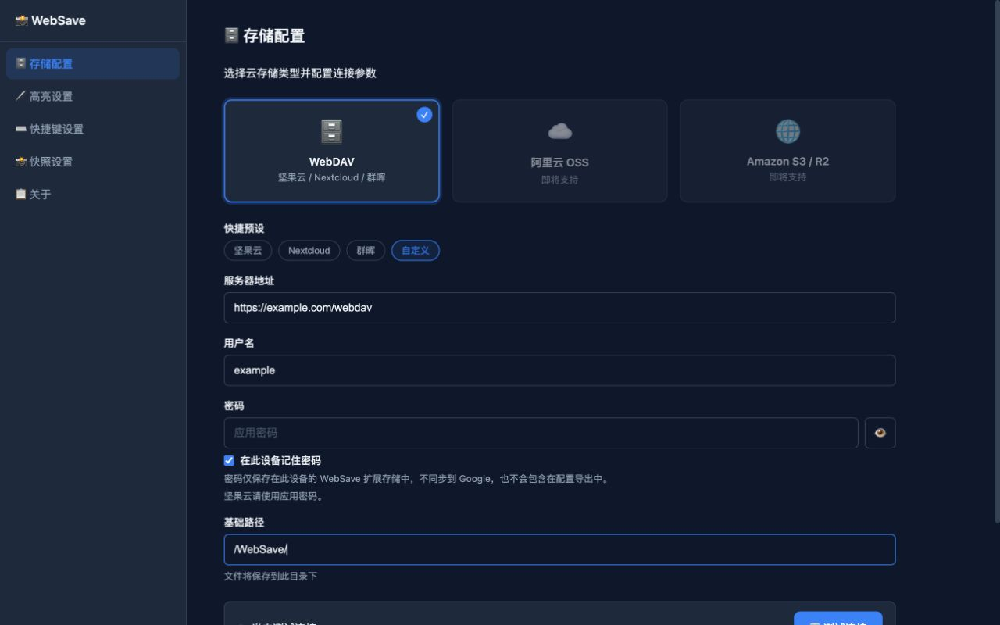
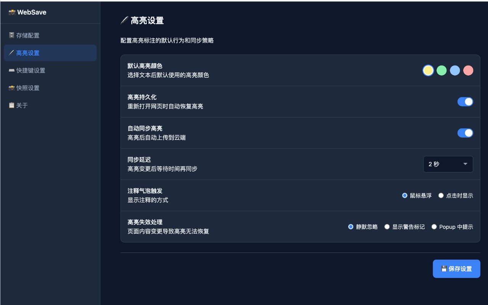
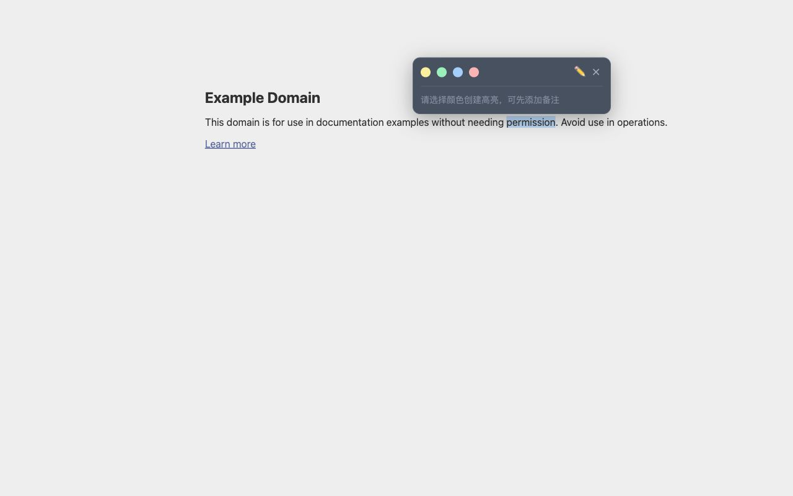

# 📸 WebSave

WebSave 是一个本地优先的 Chrome 扩展，用于把当前网页保存为 Markdown 或 HTML，并将高亮与备注保存在你自己的本地文件夹或 WebDAV/NAS 中。

> 当前状态：0.1 免费内测准备中。Chrome Web Store 链接将在审核通过后公布。

[下载 WebSave 0.1.0 编译包](downloads/websave-0.1.0.zip)

SHA-256：`13af482c23afaf2f666c5c37d8056f1ec46ea36f476f5b5154dd81d803feb0f7`

## 主要功能

- 保存当前网页为 Markdown 或可离线打开的 HTML。
- 下载或嵌入网页图片，保留来源链接与可配置 Front Matter。
- 在网页上创建高亮和备注，并与快照侧边文件同步。
- 保存到浏览器选择的本地文件夹，或保存到用户自己的 WebDAV/NAS。
- 默认可在当前设备记住 WebDAV 密码；密码不通过 Chrome Sync 同步，也不包含在配置导出中。

## 数据边界

WebSave 不提供开发者托管的网页归档，不出售数据，不展示广告，也不接入分析或 AI 服务。网页内容只会写入你选择的本地文件夹，或发送到你配置的 WebDAV 地址。

## 安装

WebSave 0.1 将先以 Chrome Web Store **Unlisted** 免费内测版本发布。商店审核完成前，内测用户可下载上方编译包并在 Chrome 开发者模式中加载解压后的目录。

公开仓库只发布编译包和产品文档，不发布 WebSave 源代码。

## 产品截图

## 文档与联系

- [隐私政策](privacy.md)
- [支持与反馈](support.md)
- 邮箱：[saixialv@gmail.com](mailto:saixialv@gmail.com)

发布者：Andy LV
